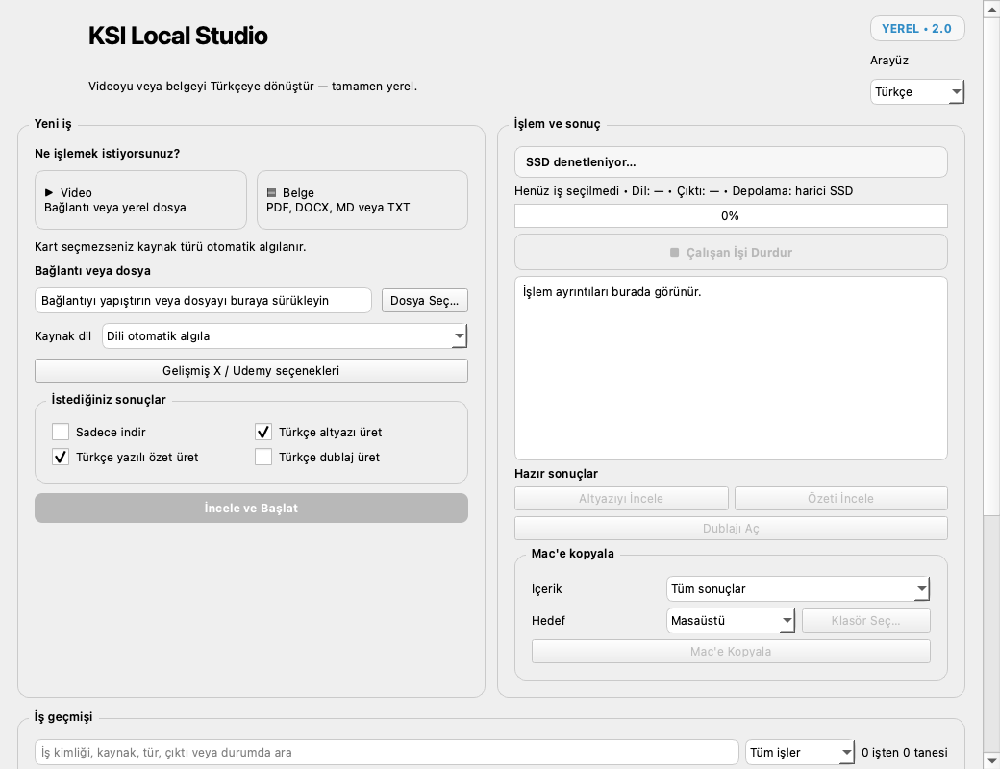
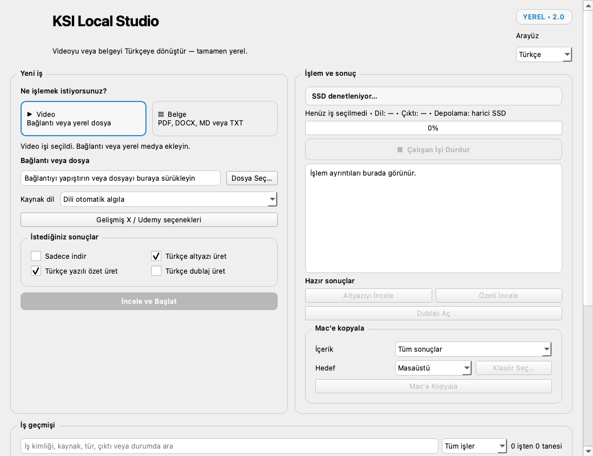

# KSI Local Studio

> Development notice (2026-10-06): the native sidebar redesign, Intel support
> and model-inclusive offline installers are under implementation. There is
> no completed new binary release yet. See the
> [accepted desktop scope](docs/decisions/2026-10-offline-desktop.md). Source
> commits are checkpoints, not evidence that final engine/installation tests
> have passed. The earlier release gates below describe the previous baseline.

KSI Local Studio is a free, subscription-free, local-first macOS application for
video, subtitle, dubbing, document, article, image and creative workflows. Codex,
ChatGPT and cloud AI APIs are optional integrations, not runtime requirements.





## Feature matrix

| Area | Local/offline | Optional network | Status |
|---|---:|---:|---|
| Local video/document inspection | Yes | No | Stable |
| Transcription, translation, summary and dubbing | Yes | No | Stable on Apple Silicon |
| YouTube and public X acquisition | Processing is local | User-started download | Supported |
| Single accessible Udemy lecture | Processing is local | Explicit session and download | Experimental |
| Images and product templates | Yes | No | Stable classical tools |
| Creative laboratory | Yes | No | Independently gated pilots |
| JSON CLI and MCP | Yes | Client-dependent | Available |

The supported baseline is a 16 GB Apple Silicon Mac. KSI Local Studio runs at most
one memory-heavy model at a time and keeps models, jobs and large media outside the
source repository in `KSI-Workspace`.

## Architecture

The GUI, `ksi` CLI and local MCP adapter use the same `ksi_local` service and safety
boundaries. Network actions require explicit user intent. Job state is checkpointed;
sources and completed results are not automatically deleted. See
[the architecture guide](docs/ARCHITECTURE.md).

The redesigned desktop uses a sidebar for Download, Video/Audio, Documents/Web,
Images, Queue, History and Library, with Help and Settings at the bottom.
System information stays in its own panel instead of opening an unsolicited dialog. Interface
language and System/Light/Dark theme are independent persisted preferences.

The new development adapters add persistent FFmpeg media jobs, constrained image
tools and explicit Gemma/Argos translation selection. Intel ASR and CPU speech
adapters are implemented, but architecture-specific runtime/model packaging and
real-engine verification remain prerequisites for claiming complete Intel support.

## Source installation

Requirements: macOS 14+, Apple Silicon and Python 3.12. Create a virtual environment,
install the project and optional GUI dependency, then run:

```bash
python -m venv .venv
.venv/bin/python -m pip install -e '.[gui]'
.venv/bin/ksi-gui
```

AI models are not included in the repository or installed by this command. The setup
wizard shows required disk space before any optional model installation. A fully offline
installer will be published only after its embedded Python runtimes pass the clean-Mac
portability gate; the current ad-hoc personal package is not that artifact.

## CLI and MCP

```bash
ksi health --json
ksi volumes --json
ksi mcp-server
```

MCP examples for Codex, Claude Code, Gemini CLI and generic stdio clients are under
[`docs/mcp`](docs/mcp/README.md). MCP clients are optional; the JSON CLI remains usable
without them.

## Privacy and legal use

- No subscription or hosted AI service is required.
- Credentials, cookies, browser profiles, user jobs, models and media are excluded from
  the public source tree.
- KSI Local Studio does not bypass DRM, CAPTCHA, paywalls or access controls.
- Only process content you are authorized to access and transform.
- Browser-session transfer is explicit, isolated and limited to supported sources.
- Models and third-party tools retain their own licenses.

See [usage and limits](docs/KULLANIM_VE_SINIRLAR.md),
[third-party notices](THIRD_PARTY_NOTICES.md), [model licenses](MODEL_LICENSES.md) and
the source [SPDX SBOM](SBOM.spdx.json).

## Development

```bash
PYTHONPATH=src .venv/bin/python -m unittest discover -s tests -v
PYTHONPATH=src .venv/bin/python scripts/build_public_source.py /new/output/directory
```

Read [CONTRIBUTING.md](CONTRIBUTING.md), [SECURITY.md](SECURITY.md) and
[AGENTS.md](AGENTS.md) before contributing.

The release gate includes a resumable, privacy-safe human acceptance ledger and a
model-free reliability audit. Acceptance records never store source URLs, account
sessions, file contents or user paths. The reliability probe uses only a temporary
directory and validates policy consistency, atomic publication, malformed worker
messages and the local-only network boundary.

Phase 40 adds a non-destructive cleanup preview and a fail-closed release evidence gate. A package
is not publishable unless it matches the current release-source fingerprint and has passed human
acceptance, clean-install acceptance, public source/history audits, reviewed cleanup, Developer ID
signing and Apple notarization. See `RELEASE_NOTES.md` for the candidate's current status.
Manifest claims alone cannot satisfy the signing or notarization checks.

## Road map

The project is preparing a notarized release candidate, completing manual acceptance on clean Macs,
and a final privacy/license audit. Windows packaging is a separate
portability project and does not delay macOS acceptance.

## Thanks

KSI Local Studio builds on the Python and Qt ecosystems and interoperates with projects
including FFmpeg, yt-dlp, Deno, Ollama, MLX Whisper, Lingua, pypdf, python-docx and
Chatterbox. Exact integration and license details are in `THIRD_PARTY_NOTICES.md`.
